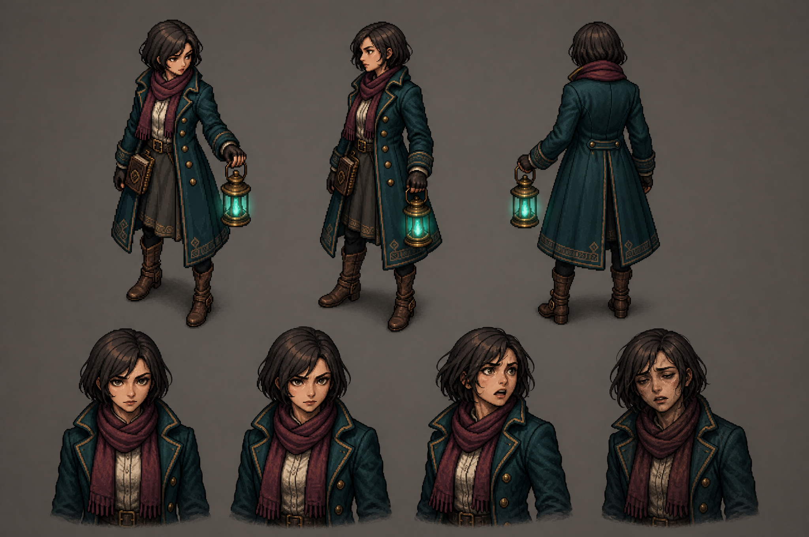
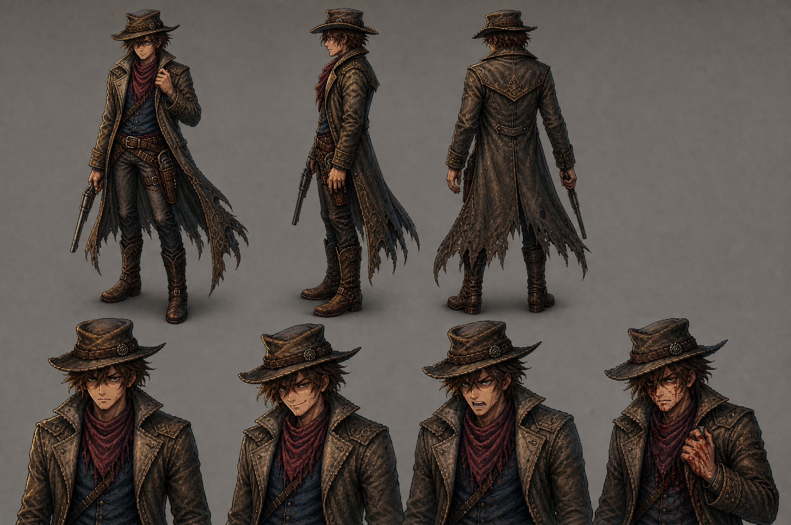
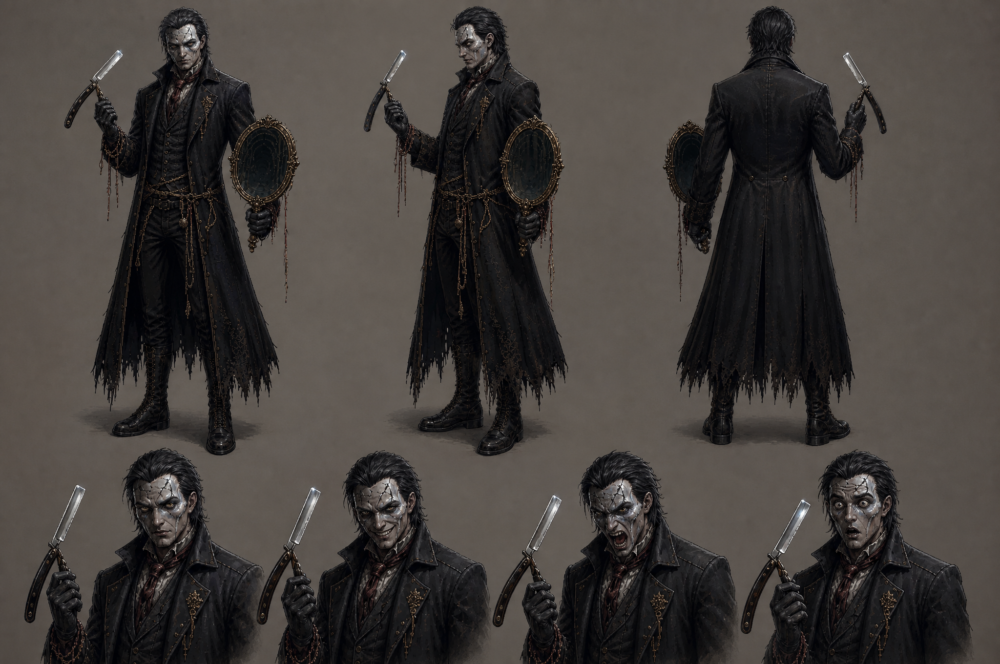
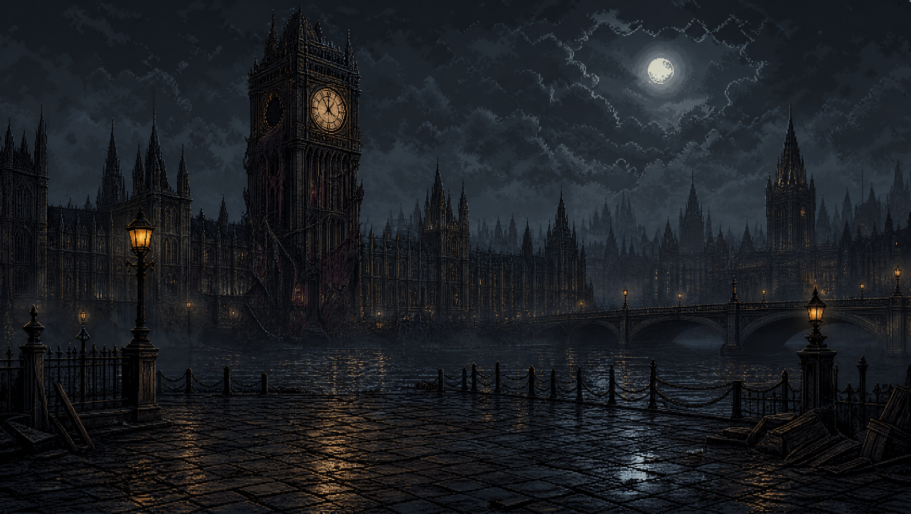
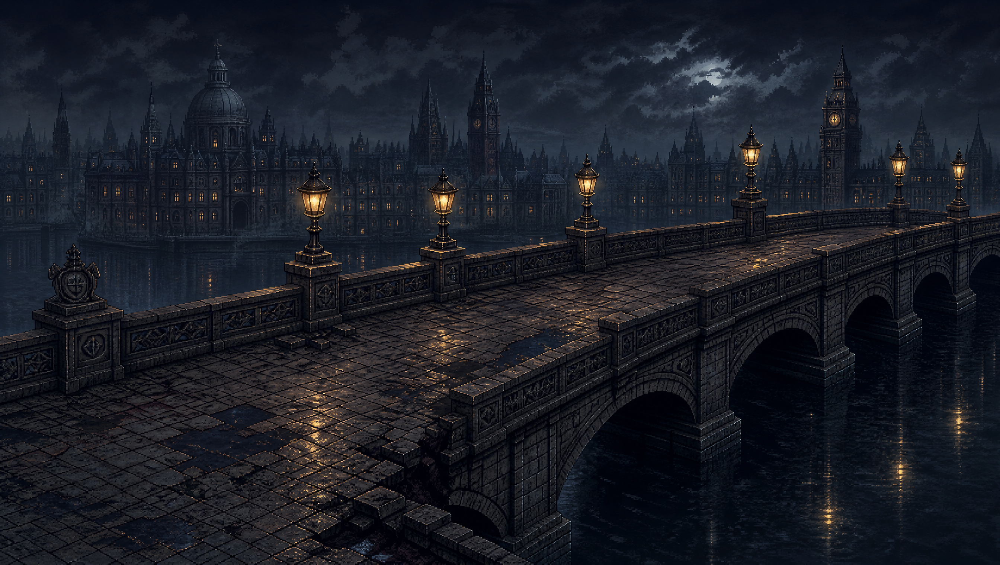
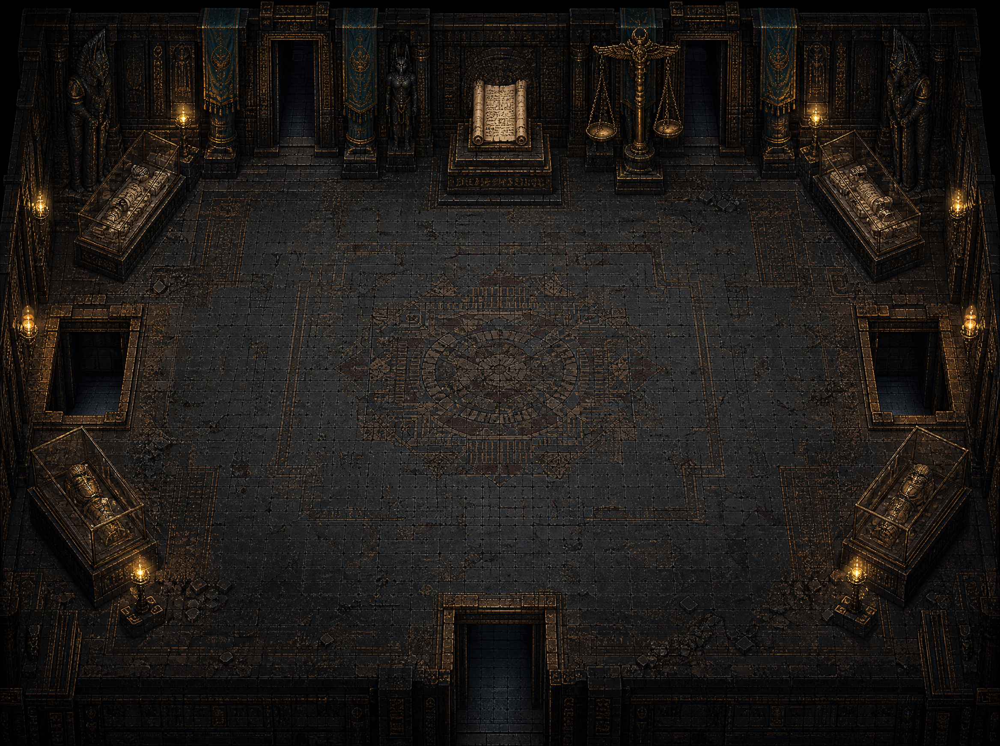
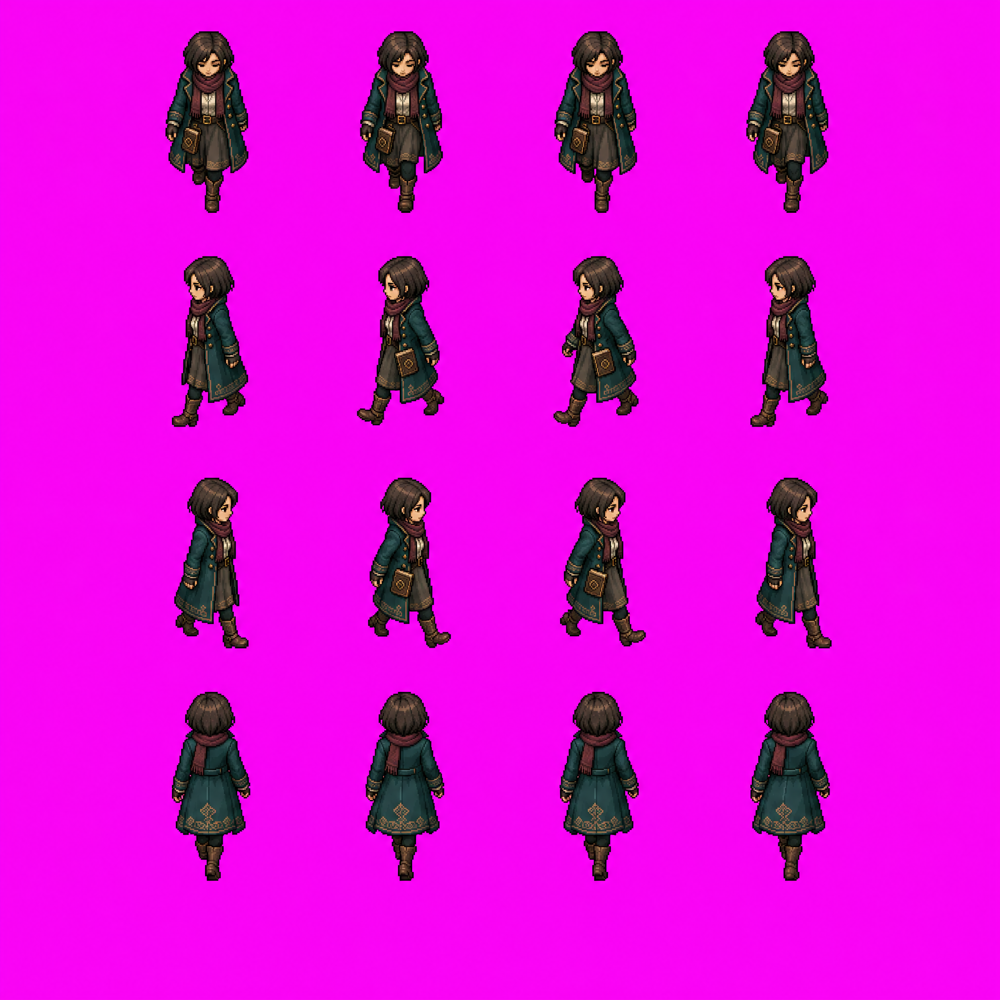
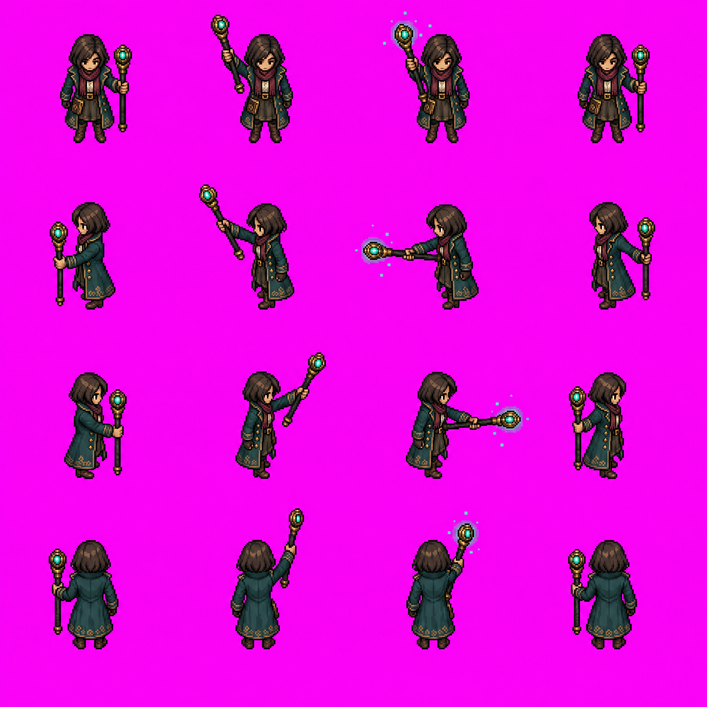

# 분리 자산 세트

여성 기록복원사와 검·리볼버·유물 지팡이 3종은 사용자 확정이다. 이름은 가칭이다. [결정](../decisions/0004-separated-assets.md)과 [생성 기록](generation-records.json)을 참고한다.

## 대화·컷신 캐릭터 시트

각 시트는 전신 3시점과 표정 4종을 포함한다. 회색 배경을 포함한 원화 시트이며 개별 투명 초상화로 패킹한 파일은 아니다.

주인공의 평상·결의 표정 차이는 작다. 코트·목도리·머리색은 유지됐으나 인물별 그림 밀도가 다르므로 최종 대화 UI 적용 전에 표현 강도를 맞춘다.

## 인물 없는 배경

빅벤과 다리는 컷신용 전경, 이집트실은 플레이 공간용 배경 원화다. 배경에 플레이어·적이 합쳐져 있지 않다. 이집트실의 상하 문과 좌우 바닥 개구부는 실제 출입·낙하 판정을 따로 설계해야 한다. 배경은 타일맵이나 충돌 데이터가 아니다.

## 주인공 게임플레이 스프라이트 원화

4×4 배열로 방향과 동작을 검토하는 초안이다. 분홍색은 배경 분리용이며 현재 RGB 원본은 투명 PNG가 아니다. 걷기의 행 순서는 아래·왼쪽·오른쪽·위. 지팡이도 동일하다. 손과 지팡이 위치의 연결, 걷기의 접지와 프레임별 크기는 후처리 대상이다.

검과 리볼버 최초 생성본은 방향 오류를 발견해 보관하고 수정 시트를 별도로 제작했다. 최종 사용 후보와 남은 결함은 [검토 기록](qa/README.md)에 기재한다.

## 무기 구성 제안

| 무기 | 역할 제안 | 시각 구분 |
| --- | --- | --- |
| 검 | 가까운 적을 넓게 견제 | 은빛 짧은 칼과 베기 궤적 |
| 리볼버 | 떨어진 표적을 정밀 사격 | 황동 총과 작은 황금색 발사광 |
| 유물 지팡이 | 신화 장치와 마법 상호작용 | 청록 결정과 원형 장식 |

무기 3종은 확정이며 피해량·사거리·자원·해금 순서는 아직 미정이다. 대화용 랜턴은 비전투 소품이고 무기를 쓸 때는 손에서 내려놓는 안을 제안한다.

## 구현 전 필요한 정리

배경 제거 → 방향별 프레임 선별 → 동일한 발 기준점과 캔버스로 정렬 → 목표 픽셀 크기로 정리 → 애니메이션 재생 검증 → 충돌·공격 판정 연결 순서다. 생성 원화의 2048px 해상도가 실제 게임 캐릭터 크기를 뜻하지 않는다. 스프라이트 원화 제작과 게임 엔진에서 사용 가능한 애니메이션 완성은 구분한다.

### 무기 시트 수정본

