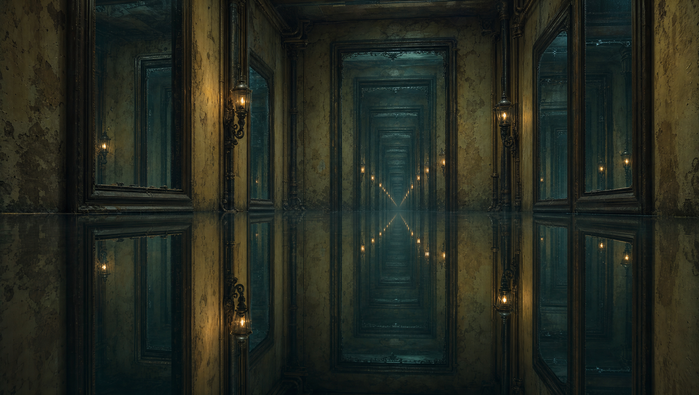
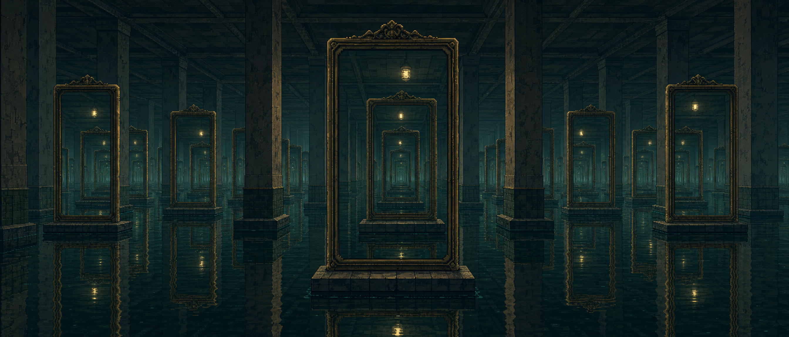
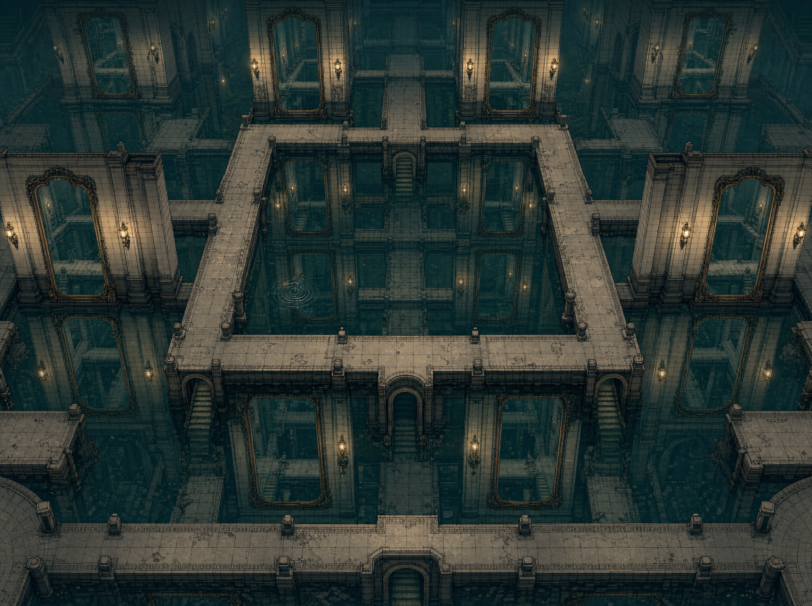

# 수면 거울 백룸

인물과 UI를 제외한 독립 배경 콘셉트. 검은 수면 아래로 거울과 구조가 끝없이 이어지는 시각 방향이다.

## 끝나지 않는 침수 복도

[프롬프트](prompts/01-drowned-corridor.txt)

## 물 아래로 이어지는 거울 수장고

[프롬프트](prompts/02-mirror-depository.txt)

## 탑다운 반사 배수실

[프롬프트](prompts/03-reflection-cistern.txt)

첫 두 장은 공간 분위기와 컷신 참고, 세 번째는 탑다운 배치 참고다. 실제 타일맵·충돌·실시간 반사 구현은 아니다.
