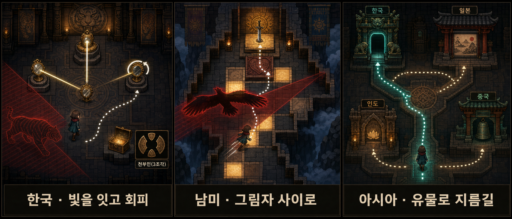
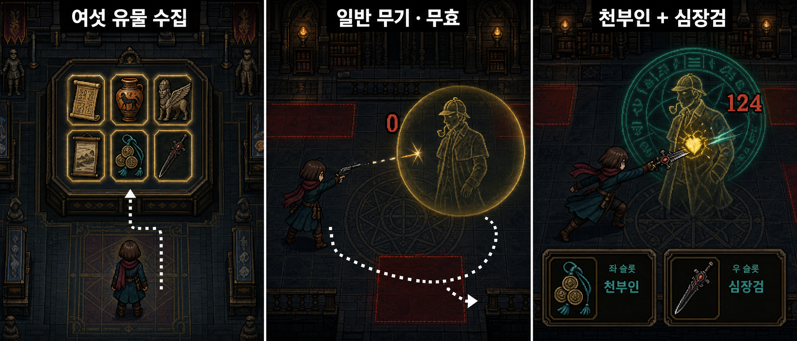
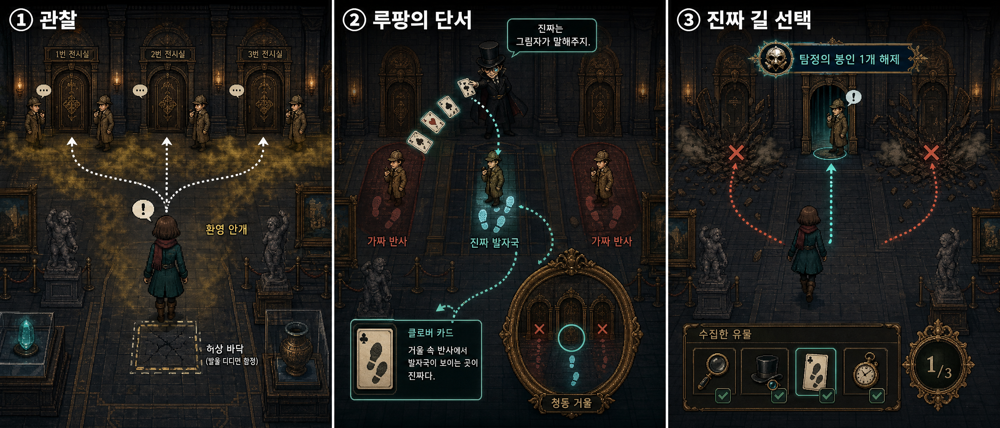
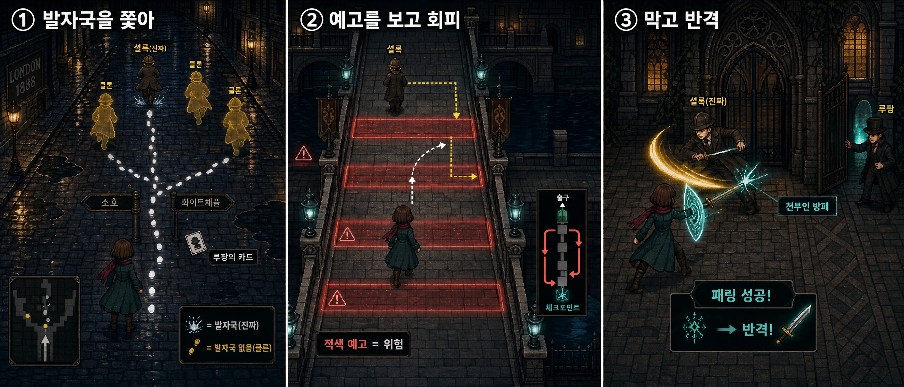
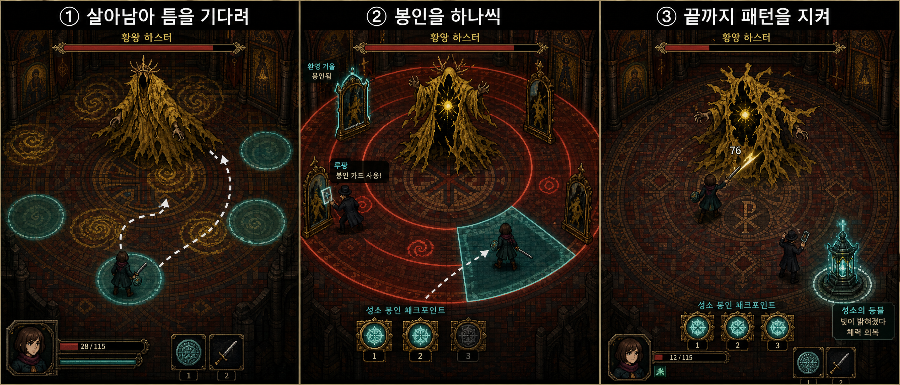
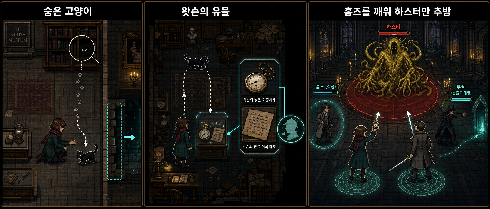

# 플레이 스토리보드

생성한 플레이 설계 이미지이며 실제 게임 캡처는 아니다. 각 장은 왼쪽에서 오른쪽으로 행동과 결과를 읽는다.

## 한국 · 천부인 / 남미 · 심장검 / 아시아 · 연결

## 여섯 유물 · 최종전 장비

## 첫 대결 · 머리

## 두 번째 대결 · 컨트롤

## 마지막 대결 · 근성

## 숨겨진 고양이 · 왓슨 · 진엔딩

[구체 규칙·실패 복구](rules.md) · [확정 설정](../../decisions/0005-hastur-finale.md)

