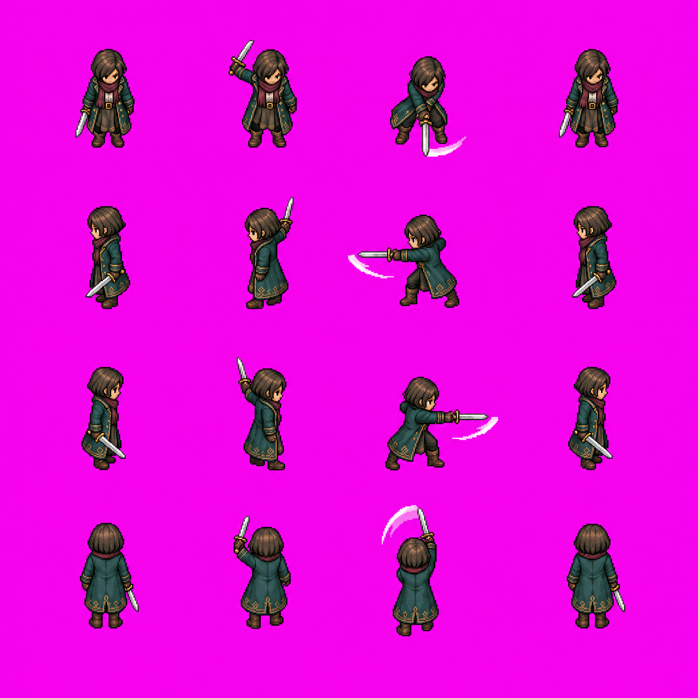
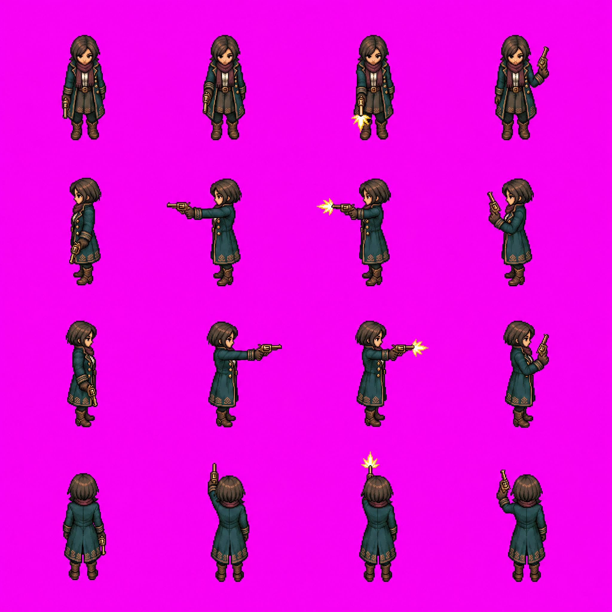

# 자산 시각 검토

2026-09-12, 원본 또는 축소 검토본을 직접 열어 확인했다. 원본 PNG 12개 디코딩 검사를 수행한다. qa JPEG는 대용량 이미지 뷰어 전달 오류를 우회한 검토본이다.

| 자산 | 확인 | 제한 |
| --- | --- | --- |
| 캐릭터 3인 | 전신 3시점·표정 4종, 기존 외형 유지 | 회색 배경 포함, 개별 초상화 미분리. 주인공 평상·결의 차이 작음 |
| 빅벤·브릿지 | 사람 없는 독립 배경 | 가상 지리, 컷신 전경용 |
| 이집트실 | 배우·적 없는 탑다운 공간 | 좌우 개구부는 출입구보다 바닥 구멍에 가까움. 충돌·출입 판정 미구현 |
| 걷기 | 아래·왼쪽·오른쪽·위의 4×4 구성 | 일부 보폭 차이 작음, 발 위치 정렬 및 재생 검사 필요 |
| 지팡이 | 4방향과 시전 효과 | 프레임 사이 쥐는 손 변경, 후처리 필요 |
| 검 수정본 | 뒷면 복구, 좌우·상하 공격 구분 | 손 위치·캐릭터 중심점 이동, 후처리 필요 |
| 리볼버 수정본 | 몸과 발사 방향 일치 | 회복 시 쥐는 손 변경, 후처리 필요 |

## 사용할 원화 후보

최초 검·리볼버 시트는 비교 기록으로 보관한다. 생성 시트는 2048×2048 RGB이며 투명 배경·정확한 셀 정렬·고정 픽셀 밀도·애니메이션 연속성을 통과한 엔진용 아틀라스가 아니다. 이번 완료 범위는 분리된 원화 시트 생성과 시각 검토이며, 게임플레이 검증은 아직 하지 않았다.
