# 콘셉트 이미지 세트 — 제13종의 밤

Higgsfield MCP / GPT Image 2 / medium / 1k. 최초 12장과 국소 수정 4회를 거쳐 아래 12장을 현재안으로 보존한다. 총 16회 생성, 전후 잔액 차이 16크레딧. 생성 결과와 프롬프트는 [기록](generation-records.json)에 연결한다.

용도: 기획·분위기·인물·전시실 디자인 검토. 애니메이션·투명 스프라이트·충돌 타일·실제 플레이 화면이 아니다. 원본 PNG를 보존했으며 외부 원본 작품을 참조 입력으로 업로드하지 않았다. 수정에는 이번 생성 결과만 사용했다.

## 1. 밤의 빅벤

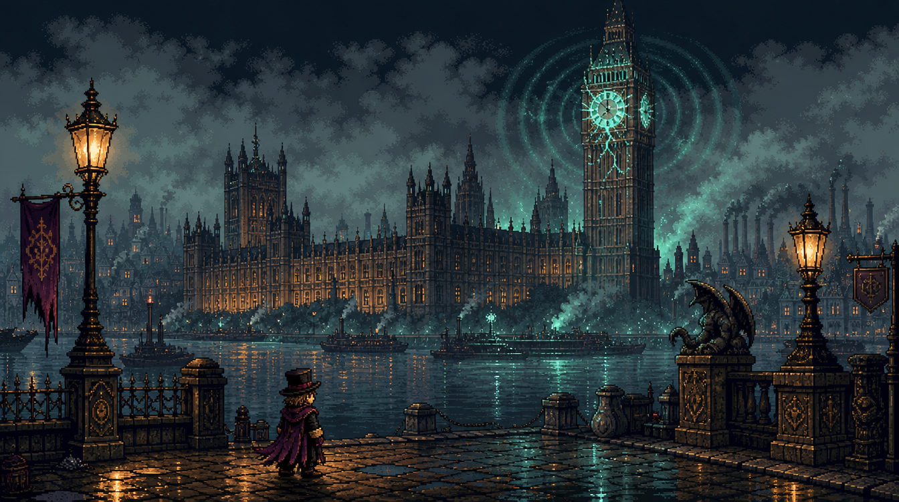

[생성 프롬프트](../prompts/01-big-ben.txt) · [원본 결과](https://d8j0ntlcm91z4.cloudfront.net/user_35dlauCY6iwRnLl0hp8vXhIHqrK/hf_20260912_083339_84410230-421e-4013-8413-d5fc1bd06f10.png)

## 2. 런던 브릿지

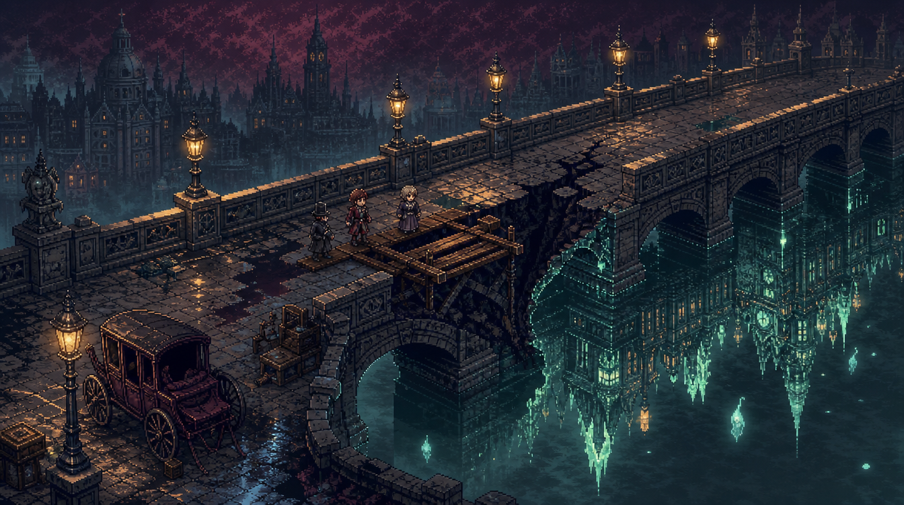

[생성 프롬프트](../prompts/02-london-bridge.txt) · [원본 결과](https://d8j0ntlcm91z4.cloudfront.net/user_35dlauCY6iwRnLl0hp8vXhIHqrK/hf_20260912_083339_194533bf-0da2-46c9-8050-21f10abfa439.png)

## 3. 박물관 외관

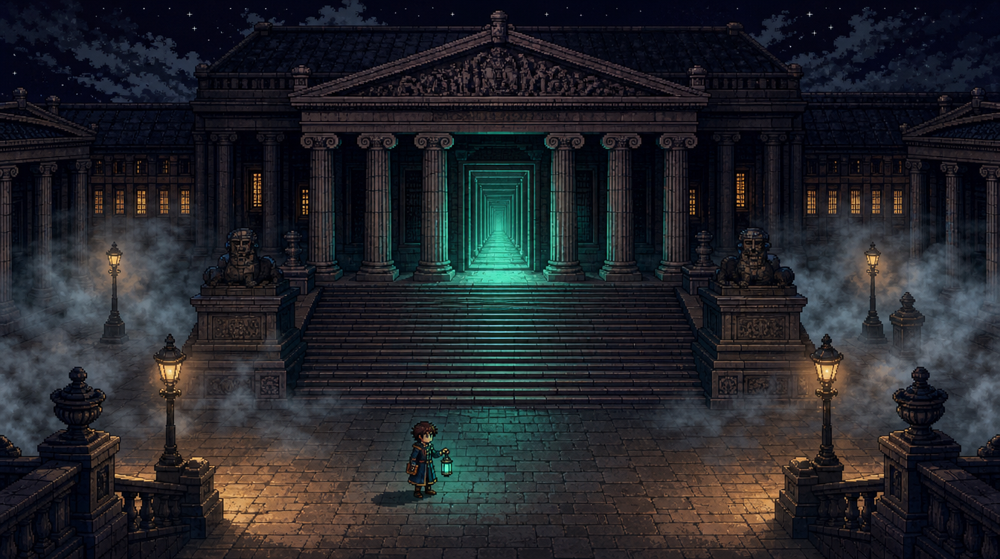

[생성 프롬프트](../prompts/03-museum-exterior.txt) · [원본 결과](https://d8j0ntlcm91z4.cloudfront.net/user_35dlauCY6iwRnLl0hp8vXhIHqrK/hf_20260912_083339_8a57cc0a-1272-407a-9d54-9ea09fe7ed51.png)

## 4. 원형 열람실 거점

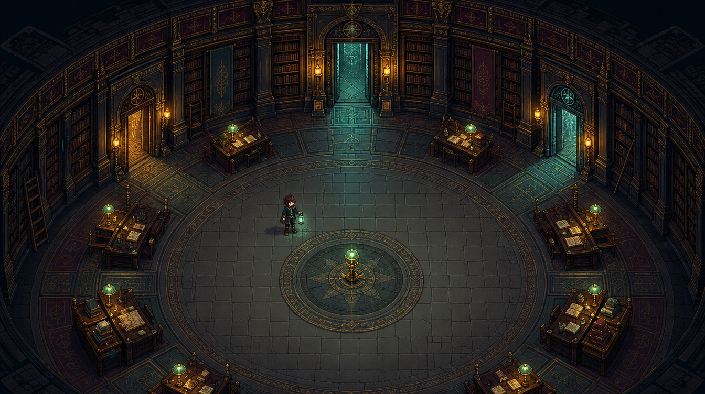

[생성 프롬프트](../prompts/04-reading-room.txt) · [원본 결과](https://d8j0ntlcm91z4.cloudfront.net/user_35dlauCY6iwRnLl0hp8vXhIHqrK/hf_20260912_083339_e9ff31c0-d3d4-4f4c-af38-a0f3be4d8b59.png)

## 5. 이집트 심판의 방

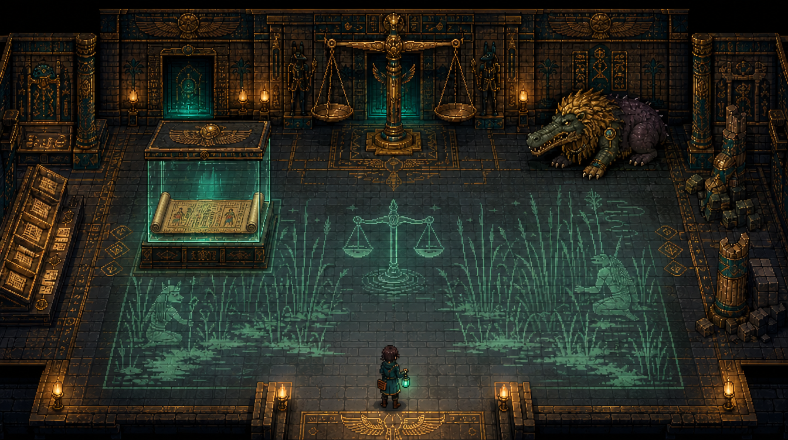

[생성 프롬프트](../prompts/05-egypt-room-revision.txt) · [원본 결과](https://d8j0ntlcm91z4.cloudfront.net/user_35dlauCY6iwRnLl0hp8vXhIHqrK/hf_20260912_083819_9c18ecb1-ff2f-47e5-b862-d885b7e95790.png)

## 6. 그리스 미궁의 방

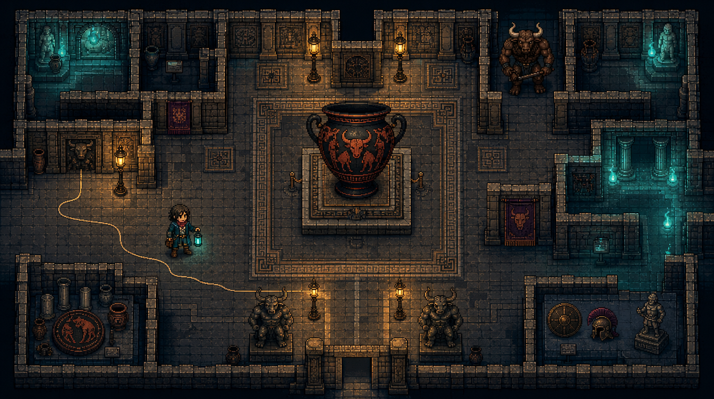

[생성 프롬프트](../prompts/06-greek-room.txt) · [원본 결과](https://d8j0ntlcm91z4.cloudfront.net/user_35dlauCY6iwRnLl0hp8vXhIHqrK/hf_20260912_083339_d89231a0-6ef0-45a2-8712-f2105c5922c1.png)

## 7. 아시리아 문지기의 방

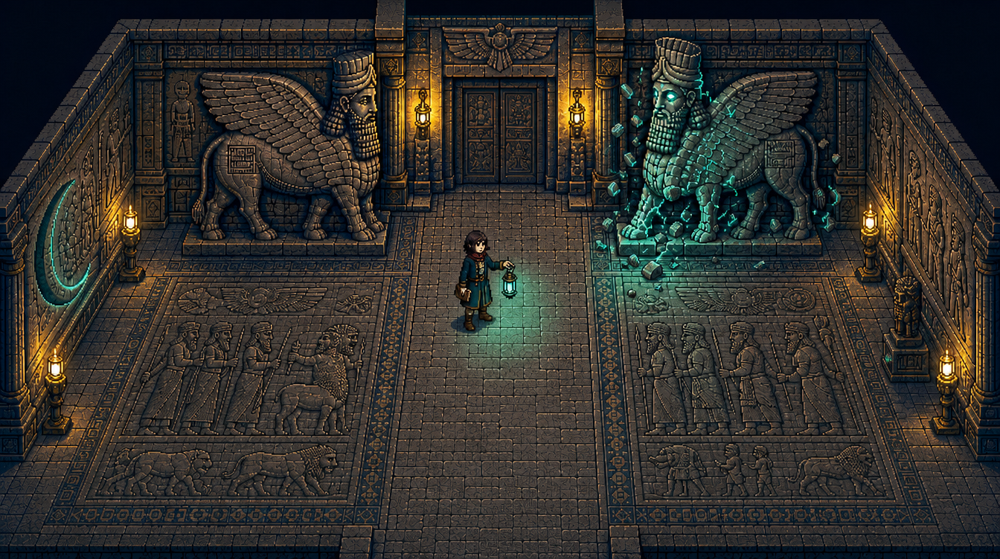

[생성 프롬프트](../prompts/07-assyrian-room-revision.txt) · [원본 결과](https://d8j0ntlcm91z4.cloudfront.net/user_35dlauCY6iwRnLl0hp8vXhIHqrK/hf_20260912_083819_1bdc81e5-caf1-4019-98a4-1f6b1a7e8a97.png)

## 8. 일본 두루마리 연회의 방

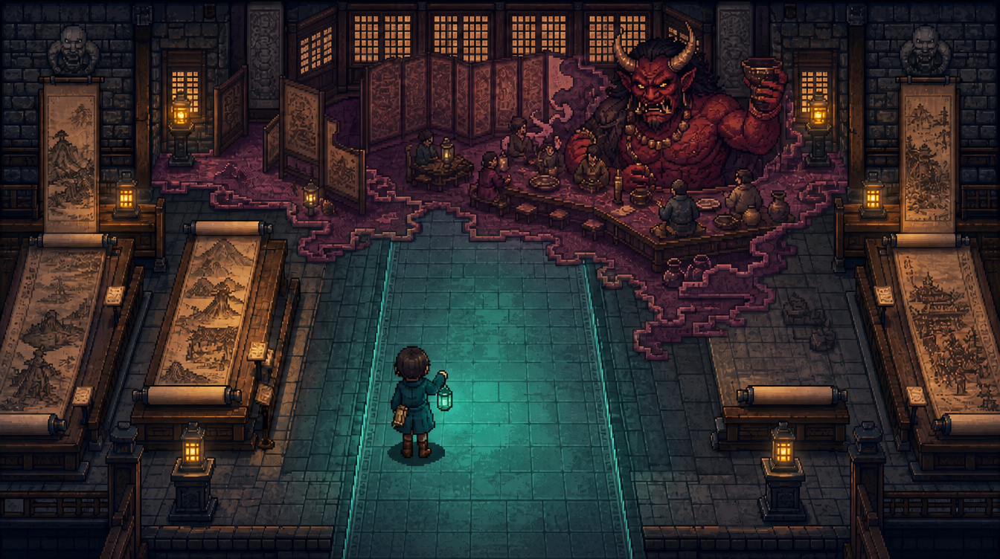

[생성 프롬프트](../prompts/08-japanese-room-revision.txt) · [원본 결과](https://d8j0ntlcm91z4.cloudfront.net/user_35dlauCY6iwRnLl0hp8vXhIHqrK/hf_20260912_083819_9693d798-0f65-4332-83b7-8c90d400baf0.png)

## 9. 기록복원사 주인공

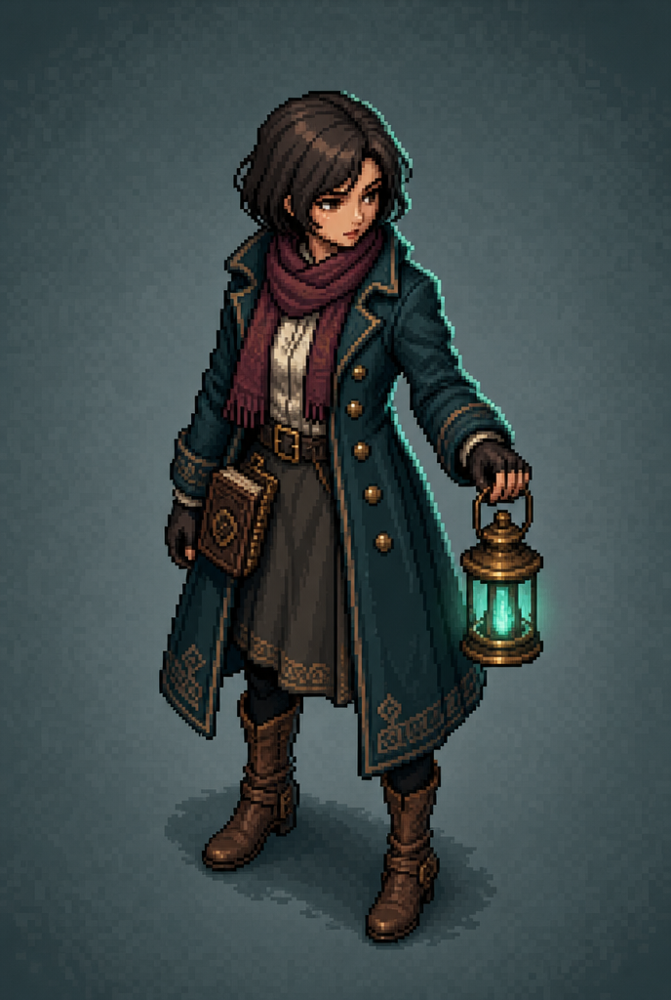

[생성 프롬프트](../prompts/09-restorer.txt) · [원본 결과](https://d8j0ntlcm91z4.cloudfront.net/user_35dlauCY6iwRnLl0hp8vXhIHqrK/hf_20260912_083344_7f5a04fd-9db0-48fc-9487-91d45e75ce1a.png)

## 10. 빌리 더 키드

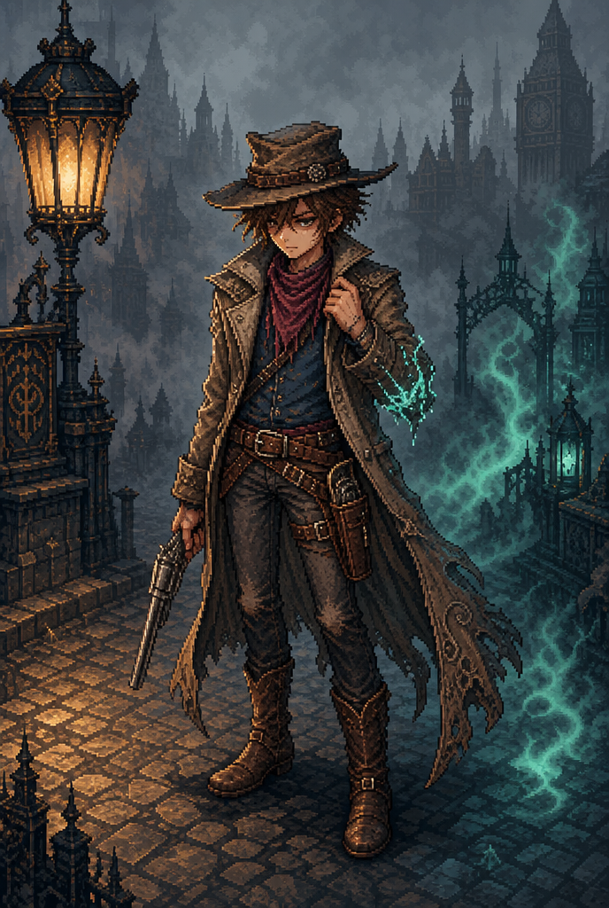

[생성 프롬프트](../prompts/10-billy.txt) · [원본 결과](https://d8j0ntlcm91z4.cloudfront.net/user_35dlauCY6iwRnLl0hp8vXhIHqrK/hf_20260912_083344_89772e42-5660-415e-9903-756d230eb071.png)

## 11. 면도날 살인마

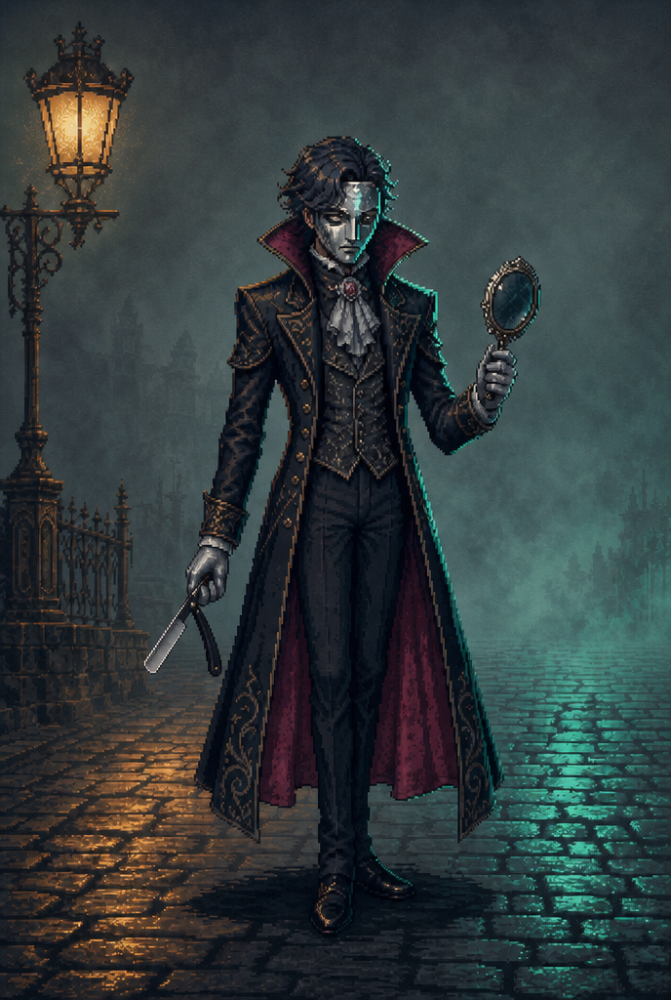

[생성 프롬프트](../prompts/11-razor-killer-revision.txt) · [원본 결과](https://d8j0ntlcm91z4.cloudfront.net/user_35dlauCY6iwRnLl0hp8vXhIHqrK/hf_20260912_083819_532175bf-523f-4a2e-9d43-c76b1103a795.png)

## 12. 암미트 적 디자인

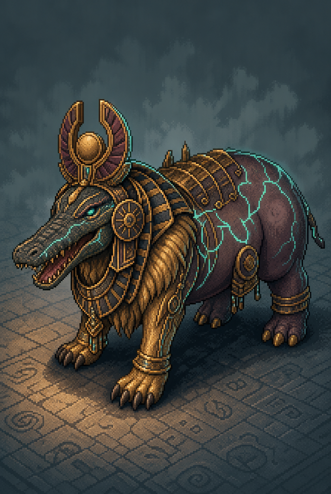

[생성 프롬프트](../prompts/12-ammit.txt) · [원본 결과](https://d8j0ntlcm91z4.cloudfront.net/user_35dlauCY6iwRnLl0hp8vXhIHqrK/hf_20260912_083344_4ce70430-671c-447a-8c39-02cda2181692.png)

## 화면 검토

- 12개 최종 PNG를 직접 열어 확인했다. 가로 8장은 1344×752, 세로 4장은 688×1024로 반환돼 요청 비율의 근사값이다.
- 빅벤의 시계 균열, 런던 브릿지의 석조 아치, 박물관의 기둥 정면, 원형 열람실을 구분할 수 있다. 건축·도상은 판타지로 변형됐으며 고증 복원 이미지가 아니다.
- 이집트 수정본은 파피루스 두루마리를 표시한다. 아시리아·일본 방의 중복 전경 인물을 제거했다. 살인마 수정본은 펼친 접이식 면도칼을 표시한다.
- 네 문화 구역에서 저울·도기 미궁·날개 수호상·두루마리 연회가 시각적으로 구분된다.
- 인물 이미지와 방 안 인물의 비율·복식 세부·픽셀 밀도가 완전히 일치하지 않는다. 빌리·살인마는 배경이 있는 전신 콘셉트로 생성됐다. 다음 단계에서 주인공을 선택한 뒤 한 기준 이미지로 방향별 스프라이트를 제작해야 한다.
- 전체적으로 어두운 팔레트다. 실제 게임에서는 벽 경계·공격 예고·조사 대상의 대비를 조작 화면에서 검증해야 한다.
