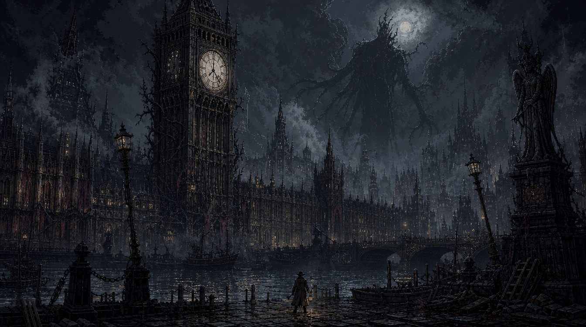
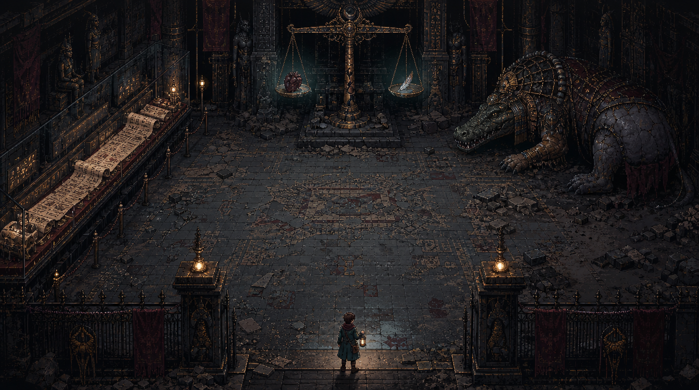
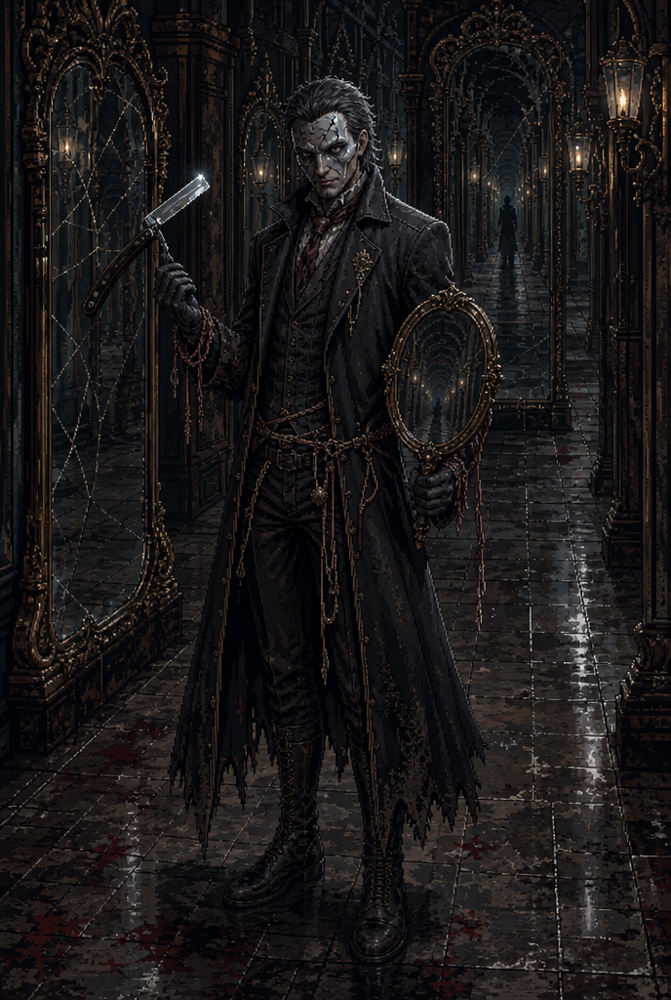

# 다크 판타지 콘셉트 시안

Higgsfield의 gpt_image_2로 생성한 방향 검토용 이미지 3장. 확정 방향은 [결정 기록](../decisions/0003-dark-fantasy.md)을 따른다.

## 밤의 빅벤

거대한 시계탑과 작은 인물의 대비, 잿빛 안개와 금빛 조명으로 도시의 위협을 표현했다. [프롬프트](../prompts/13-dark-big-ben.txt)

## 이집트 전시실

탑다운 바닥 구도, 두루마리와 저울, 거대한 아미트로 탐험과 전투 공간의 방향을 제시한다. [프롬프트](../prompts/14-dark-egypt.txt)

## 면도날 살인마

자연스러운 성인 비율과 펼친 면도칼, 거울 복도로 위협감을 강화했다. 인물의 최종 정체는 아직 제안이다. [프롬프트](../prompts/15-dark-razor.txt)

## 검토

세 원본을 직접 열어 구도·인체 비율·소품을 확인했다. 분위기는 승인된 다크 판타지 방향에 맞는다. 다만 어두운 색조를 실제 게임에 그대로 쓰면 적과 바닥의 구분이 약해질 수 있어, 구현 시 상호작용 대상의 명도 대비를 별도로 검증해야 한다. 이 이미지는 콘셉트이며 타일·애니메이션·게임용 스프라이트로 검증되지 않았다.

생성 모델·작업 ID·원본 URL: [기록](dark-fantasy-records.json). 이전 방향 비교: [초기 12장](README.md).
